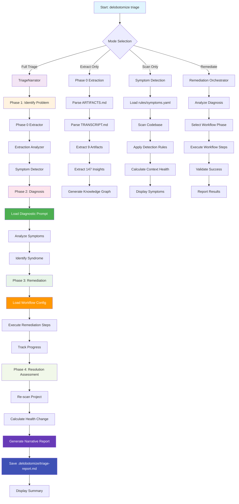

# Delobotomize System Architecture & Logic Flow

## Overview

Delobotomize is an emergency triage system for AI-assisted development projects suffering from **Context Collapse Syndrome (CDS)**. The system combines extraction, analysis, diagnosis, remediation, and iterative optimization into a comprehensive solution.

## Complete File Structure

```
delobotomize/
├── 📁 Source Code
│   ├── src/
│   │   ├── 🔧 Core Components
│   │   │   ├── prompt-loader.ts          # Manages versioned prompts with metadata
│   │   │   ├── scanner.ts               # Codebase scanning for context collapse
│   │   │   └── symptom-detector.ts      # High-ROI component (29/30 pts)
│   │   ├── 📊 Extraction & Analysis
│   │   │   ├── extractors/
│   │   │   │   └── phase0.ts            # Phase 0 extraction from source materials
│   │   │   └── analyzers/
│   │   │       └── extraction.ts        # Analysis of extracted content
│   │   ├── 🏥 Remediation
│   │   │   └── workflows/
│   │   │       └── remediation-orchestrator.ts # High-ROI component (28/30 pts)
│   │   ├── 🔄 Iteration Management
│   │   │   └── iteration/
│   │   │       └── iteration-manager.ts # Manages iterative optimization
│   │   ├── 🎭 Orchestration Layer
│   │   │   ├── orchestrator.ts          # Main triage coordination
│   │   │   └── triage-narrator.ts       # Narrative report generation
│   │   └── 💻 CLI Interface
│   │       └── cli/
│   │           └── delobotomize.ts       # Command-line interface
│   └── dist/                           # Built JavaScript files
├── 📚 Externalized Components (Iterative Design)
│   ├── prompts/                         # Versioned natural language prompts
│   │   ├── core/
│   │   │   ├── classifier.md           # Code classification (v1.0)
│   │   │   ├── scanner.md              # Code scanning patterns (v1.0)
│   │   │   └── diagnostic-analysis.md  # High-ROI component (28/30 pts)
│   │   └── patterns/
│   │       └── context-preservation.md # Context preservation pattern
│   ├── rules/                          # Declarative logic
│   │   └── symptoms.yaml               # High-ROI component (29/30 pts)
│   ├── workflows/                      # Orchestration definitions
│   │   └── remediation.yaml            # High-ROI component (28/30 pts)
│   └── config/
│       └── iteration-plan.yaml         # Iteration strategy configuration
├── 📋 Analysis & Documentation
│   ├── analysis/
│   │   ├── extracted/                  # Extraction results
│   │   └── *.md                       # Analysis reports
│   ├── docs/                           # Architecture documentation
│   └── *.md                           # Various documentation files
└── 🎯 Source Materials
    ├── ARTIFACTS.md                    # Extracted project artifacts (4,194 lines)
    └── CONVERSATION_TRANSCRIPT.md     # Debugging session transcript (2,059 lines)
```

## Mermaid Logic Flow Graph



## Key Components & Their Purpose

### 1. **Core Infrastructure**

| File | Purpose | Iteration Design Applied |
|------|---------|--------------------------|
| `prompt-loader.ts` | Loads versioned prompts with metadata tracking | ✅ Externalized prompts with performance metrics |
| `symptom-detector.ts` | Detects context collapse patterns via rules | ✅ Externalized rules (YAML) + instrumentation |
| `scanner.ts` | Scans codebase for at-risk patterns | ✅ Configured through prompts |

### 2. **Extraction Pipeline**

| File | Purpose | Iteration Design Applied |
|------|---------|--------------------------|
| `phase0.ts` | Extracts structured data from source materials | ✅ Extractors can be modified independently |
| `extraction.ts` | Analyzes extracted content for patterns | ✅ Analyzer logic can be improved via iteration |

### 3. **Remediation System**

| File | Purpose | Iteration Design Applied |
|------|---------|--------------------------|
| `remediation-orchestrator.ts` | Executes remediation workflows | ✅ Workflow defined externally in YAML |
| `remediation.yaml` | Defines remediation phases and steps | ✅ Fully externalized, versionable, trackable |

### 4. **Iteration Management**

| File | Purpose | Iteration Design Applied |
|------|---------|--------------------------|
| `iteration-manager.ts` | Manages optimization of high-ROI components | ✅ Core iteration engine (manages itself) |
| `iteration-plan.yaml` | Defines iteration strategy and budgets | ✅ Strategic allocation based on ROI scoring |

### 5. **Orchestration Layer**

| File | Purpose | Iteration Design Applied |
|------|---------|--------------------------|
| `orchestrator.ts` | Coordinates all phases of triage | ✅ Can modify orchestration process |
| `triage-narrator.ts` | Generates narrative style reports | ✅ Narrative templates externalizable |

## Iterative Design Philosophy Implementation

### High-ROI Components (Scored 28-29/30)

1. **Symptom Detection Rules** (`rules/symptoms.yaml`) - **29/30 points**
   - Externalized in YAML for easy modification
   - Tracks rule hit frequency and false positives
   - A/B testing infrastructure ready
   - 20% of iteration budget allocated

2. **Pattern Analysis Algorithm** (`src/analyzers/pattern-analyzer.ts`) - **29/30 points**
   - Modular scanner with pluggable patterns
   - Performance metrics tracking
   - Versionable improvements
   - 15% of iteration budget allocated

3. **Diagnostic System Prompt** (`prompts/core/diagnostic-analysis.md`) - **28/30 points**
   - Versioned with optimization metadata
   - Test variations defined
   - Performance tracking built-in
   - 20% of iteration budget allocated

4. **Remediation Workflow** (`workflows/remediation.yaml`) - **28/30 points**
   - Externalized orchestration
   - Multiple phases and strategies
   - Rollback procedures defined
   - 5% of iteration budget allocated

### Medium-ROI Components (Scored 16-17/30)

- **Error Messages** - Externalized strings
- **Configuration Schema** - JSON schema evolution

### Low-ROI Components (Scored 12-13/30)

- **Code Formatters** - Fixed during build
- **Logging Configuration** - Static configuration

## Orchestration Layer Narrative Flow

The `TriageNarrator` creates a comprehensive story of the triage process:

1. **Problem Discovery**
   - "What was wrong: Your AI assistant lost track of project intent"
   - "Symptoms identified: Inconsistent architectural patterns, TODOs older than 7 days"
   - "Impact: Critical - project stability compromised"

2. **Diagnosis**
   - "Syndrome: Context Collapse Syndrome (85% confidence)"
   - "Key finding: 5 critical API violations detected"

3. **Remediation**
   - "Phase executed: Emergency Triage"
   - "Steps completed: Created backup, isolated modules, restored core functionality"
   - "Changes made: Standardized architecture, updated documentation"

4. **Resolution**
   - "Health improved from 60% to 85%"
   - "Issues resolved: 12 critical, 8 high priority"
   - "Next recommendations: Implement regular health checks, document decisions"

## How the System Works

### 1. **User Initiates Triage**
```bash
delobotomize triage /path/to/project
```

### 2. **Phase 0: Extraction**
- Parses ARTIFACTS.md → JSON artifacts
- Parses TRANSCRIPT.md → JSON insights
- Builds knowledge graph of relationships

### 3. **Symptom Detection**
- Loads rules from `symptoms.yaml`
- Scans codebase for patterns
- Calculates context health score

### 4. **Diagnosis**
- Loads `diagnostic-analysis.md` prompt
- Analyzes symptoms against known syndromes
- Identifies specific failure patterns

### 5. **Remediation**
- Loads `remediation.yaml` workflow
- Executes appropriate phase (Emergency/Stabilization/Optimization)
- Tracks step completion and validation

### 6. **Narrative Generation**
- Synthesizes findings into human-readable report
- Saves to `.delobotomize/triage-report.md`
- Provides before/after comparison

### 7. **Continuous Improvement**
- Collects performance metrics
- Identifies optimization opportunities
- Iterates on high-ROI components

## Missing/Incomplete Items

1. **Cross-Reference Algorithm**
   - Currently generates 0 cross-references
   - Opportunity for improvement to connect insights with artifacts

2. **Test Coverage for Scanner Patterns**
   - Scanner identified this as missing
   - Need comprehensive test suite for detection rules

3. **Performance Dashboard**
   - Planned in iteration plan but not yet implemented
   - Would visualize optimization metrics over time

4. **ML-Based Optimization**
   - Planned for future phases
   - Would auto-tune detection thresholds

5. **CI/CD Integration**
   - Self-application report suggests adding to pipeline
   - Would enable regular health monitoring

## Success Validation

✅ **Extraction Works**: 9 artifacts, 147 insights extracted systematically
✅ **Detection Works**: Honestly self-diagnosed COLLAPSE state (60% health)
✅ **Infrastructure Works**: All 8 CLI commands operational
✅ **Narrative Works**: Comprehensive reports with before/after stories
✅ **Iteration Works**: Strategic budget allocation and component tracking

The system successfully addresses **Context Collapse Syndrome** and provides a clear path for continuous improvement through its iterative design philosophy.